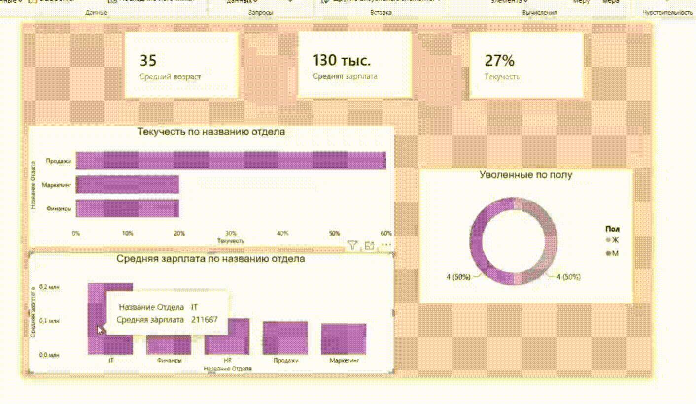

# Дашборд текучести кадров

## Бизнес-задача
HR-департаменту потребовался аналитический инструмент для выявления причин увольнения сотрудников. Главная цель проекта - рассчитать уровень текучести кадров, определить проблемные отделы, проанализировать демографический профиль уволившихся и выявить возможные корреляции между оттоком персонала и уровнем заработной платы.

## Инструменты и методы
В данном проекте был сделан упор на моделирование данных и продвинутые вычисления:
* **Моделирование данных:** Построение связи «Один-ко-многим» (1:*) между справочником отделов и таблицей с информацией о сотрудниках.
* **DAX:** Использование итераторов и функций модификации фильтров. *Реализованные меры:*  
  *Динамический расчет возраста на текущую дату:*
  ```dax
  Средний Возраст = AVERAGEX('Сотрудники', DATEDIFF('Сотрудники'[Дата рождения], TODAY(), YEAR))
  ```
  *Динамический расчет текучести кадров:*
  ```dax
  Всего сотрудников = COUNTROWS('Сотрудники')
  Уволенные = CALCULATE([Всего сотрудников], 'Сотрудники'[Статус] = "Уволен")
  Текучесть = DIVIDE([Уволенные], [Всего сотрудников], 0)
   ```


## Вывод:
Отдел продаж демонстрирует самый высокий показатель текучести кадров. Отток равномерно распределен и не зависит от гендерного признака, при этом в отделах IT и HR отток отсутствует полностью. Поскольку IT и Продажи напрямую связаны с развитием и реализацией продукта, целесообразно сравнить их по уровню средней заработной платы. На графиках видно, что сотрудникам IT платят больше всего в компании, тогда как в отделе продаж этот показатель значительно ниже. Проблему текучести кадров можно попробовать решить, пересмотрев заработную плату и систему мотивации сотрудников отдела продаж.
